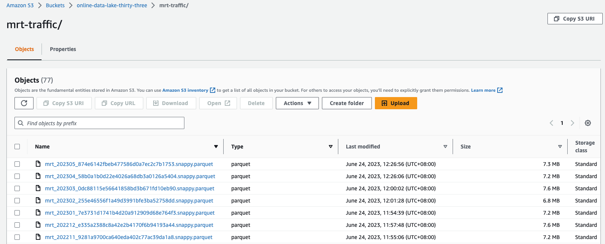
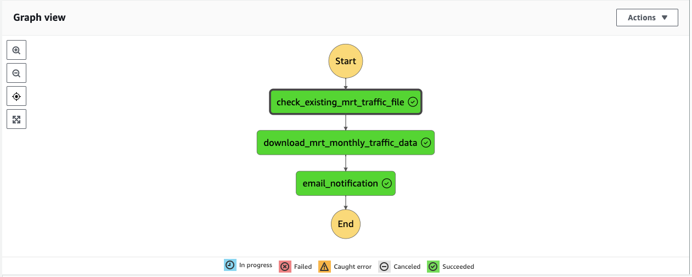
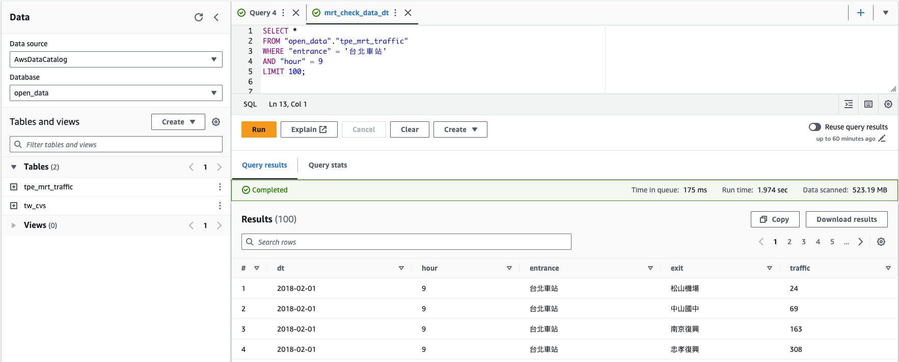

# tpe-mrt-traffic-etl-serverless

A serverless ETL pipeline deployed by Serverless Framework

The process consist of 3 functions:
  - __mrt_traffic_file_list__: check existing object files in assigned s3 bucket, and return a list of existing files
  - __mrt_traffic__          : get the offical dataset table, which contains year-month of dataset, and file url,
                           download the dataset after comparing dataset table with the list recieved from __mrt_traffic_file_list__,
  - __email_notification__   : send notifying email containing number of files downloaded, and year-month of downloaded files

Objects in S3

  

These functions can be further structured into a data pipeline using AWS Step Function:

  

Analyze data in AWS Athena:

  

